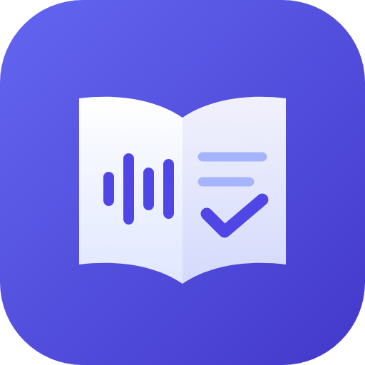
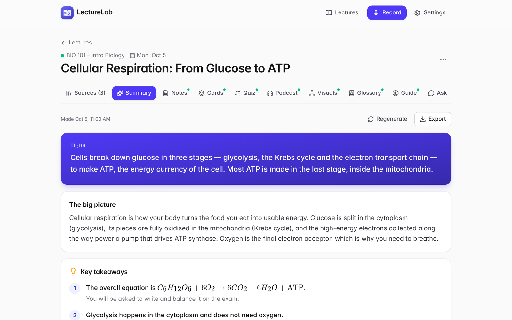
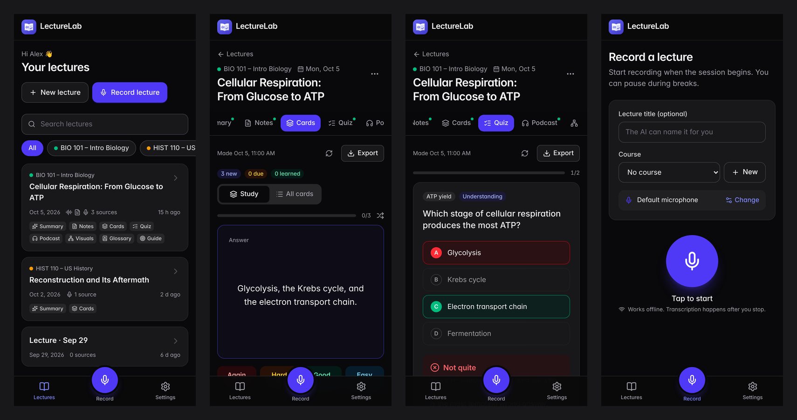

<p align="center">
  
</p>

<h1 align="center">LectureLab</h1>

<p align="center">
  Record or upload lectures and turn them into study notes, flashcards, practice quizzes,<br />
  a study podcast, visual summaries and an AI tutor grounded in your own course material.
</p>

<p align="center">
  <a href="https://github.com/helalaou/lecturelab/actions/workflows/ci.yml"></a>
  <a href="LICENSE"></a>
  
  
</p>

<p align="center">
  
</p>

## Overview

LectureLab is an open-source study companion. Capture a lecture with any microphone, or bring
recordings, slides, readings and notes you already have. LectureLab transcribes the audio, combines
every source for that lecture, and generates a complete set of study material you can review on
your laptop or phone.

It is a static React app on Netlify with a handful of serverless functions, Firebase for sign-in
and data, and OpenAI models for transcription, writing and speech. Everything runs on the free
tiers of Netlify and Firebase. You pay only for the OpenAI usage, typically a few tens of cents
per hour of lecture.

## Features

|                                  |                                                                                                                                                                                                                                     |
| -------------------------------- | ----------------------------------------------------------------------------------------------------------------------------------------------------------------------------------------------------------------------------------- |
| **Live recording**               | Records in the browser with a selectable input device, level meter, pause/resume and screen wake lock. Audio is written to IndexedDB as it is captured, so a closed tab or lost connection never loses a session.                   |
| **Multiple sources per lecture** | Combine recordings, audio or video files, PDF, Word and text documents, and pasted notes. Every tool reasons over all of them together.                                                                                             |
| **Accurate transcription**       | Audio is resampled to 16 kHz and split at natural pauses into ~60 s chunks, transcribed in parallel with context carried across chunk boundaries, and stored with timestamps. Tap any line to jump to that moment in the recording. |
| **Summary**                      | TL;DR, the big picture, key takeaways, what the instructor emphasised, likely exam topics and announcements.                                                                                                                        |
| **Study notes and study guide**  | Structured Markdown with definitions, worked examples, LaTeX formulas, comparison tables, self-check questions and a three-session study plan.                                                                                      |
| **Flashcards**                   | Single-concept cards in several styles (definition, concept, application, formula, process) with SM-2 spaced repetition.                                                                                                            |
| **Practice quiz**                | Multiple choice, true/false and short answer, with an explanation for every answer and a retry-what-you-missed mode.                                                                                                                |
| **Study podcast**                | A two-host audio episode that teaches the material, with playback speed control and a synced, tappable script.                                                                                                                      |
| **Visuals**                      | Mind maps, concept maps, flowcharts, timelines, sequence diagrams and comparison tables, rendered with Mermaid.                                                                                                                     |
| **Glossary**                     | Searchable key terms grouped by category, with examples and cross-links.                                                                                                                                                            |
| **Ask the lecture**              | A chat tutor that answers from your sources and cites timestamps, and says so when something was not covered.                                                                                                                       |
| **Export**                       | PDF, Markdown, Anki deck, CSV (Quizlet, spreadsheets) and MP3.                                                                                                                                                                      |
| **Personal settings**            | Light, dark or system theme; microphone choice and audio processing; detail level; output language; models and podcast voices.                                                                                                      |
| **Bring your own key**           | The deployment owner's OpenAI key is used only for allowlisted accounts. Everyone else adds their own key, which is encrypted at rest and never returned to the browser.                                                            |

<p align="center">
  
</p>

## Architecture

```
Browser (React, Vite, Tailwind CSS)
 ├─ Recording: AudioWorklet → 16 kHz PCM chunks + compressed copy for playback (IndexedDB-backed)
 ├─ Documents: PDF and DOCX text extraction in the browser (pdf.js, mammoth)
 ├─ Firebase Auth (Google or email link) and Firestore (per-user security rules)
 └─ /api/* Netlify Functions
      ├─ transcribe   one audio chunk → text
      ├─ generate     streams a study tool as it is written
      ├─ chat         streams tutor answers
      ├─ tts          one podcast line → MP3
      ├─ audio        chunked upload and signed, range-capable playback (Netlify Blobs)
      ├─ key          save or remove a personal OpenAI key (AES-256-GCM)
      └─ me           reports which key, if any, the user can use
```

The functions verify the user's Firebase ID token and call Firestore with that same token, so the
security rules in [`firestore.rules`](firestore.rules) apply to every read and write and no
service-account credentials are needed. See [docs/ARCHITECTURE.md](docs/ARCHITECTURE.md) for the
details.

All AI behaviour is defined in [`netlify/lib/prompts.ts`](netlify/lib/prompts.ts): one system
prompt shared by every tool, a task prompt per tool, and strict JSON schemas for the structured
outputs.

## Getting started

### Prerequisites

- Node.js 20.19 or newer (22 recommended, see `.nvmrc`)
- A Firebase project (free Spark plan)
- An OpenAI API key

### 1. Install

```bash
git clone https://github.com/helalaou/lecturelab.git
cd lecturelab
npm install
```

### 2. Set up Firebase

1. Create a project in the [Firebase console](https://console.firebase.google.com).
2. **Project settings → Your apps → Add app → Web**, and copy the config values.
3. **Authentication → Sign-in method**: enable **Google** and **Email/Password** with **Email link
   (passwordless sign-in)**.
4. **Firestore Database → Create database** in production mode. Then publish the rules, either by
   pasting [`firestore.rules`](firestore.rules) into the console or with `npm run deploy:rules`.

### 3. Configure

```bash
cp .env.example .env
```

Fill in the values described in [Configuration](#configuration).

### 4. Run

```bash
npm run dev
```

This starts Netlify Dev on <http://localhost:8888>, serving the app, the functions and a local
Blobs store together.

## Configuration

| Variable                    | Required | Description                                                                                                                                      |
| --------------------------- | -------- | ------------------------------------------------------------------------------------------------------------------------------------------------ |
| `VITE_FIREBASE_API_KEY`     | Yes      | Firebase web app API key                                                                                                                         |
| `VITE_FIREBASE_AUTH_DOMAIN` | Yes      | Usually `<project-id>.firebaseapp.com`                                                                                                           |
| `VITE_FIREBASE_PROJECT_ID`  | Yes      | Firebase project ID, also used by the functions                                                                                                  |
| `VITE_FIREBASE_APP_ID`      | Yes      | Firebase web app ID                                                                                                                              |
| `KEY_ENCRYPTION_SECRET`     | Yes      | Random secret that encrypts personal API keys and signs audio links. Generate with `openssl rand -base64 32`, and do not change it after launch. |
| `OPENAI_API_KEY`            | No       | Shared key for allowlisted accounts. Leave empty to require every user to bring their own.                                                       |
| `ALLOWED_EMAILS`            | No       | Comma-separated emails that may use `OPENAI_API_KEY`                                                                                             |

Product name and tagline live in [`shared/app.ts`](shared/app.ts); default models, voices and
languages in [`shared/settings.ts`](shared/settings.ts); size limits in
[`shared/limits.ts`](shared/limits.ts).

## Deployment

LectureLab deploys to Netlify straight from this repository. `netlify.toml` already defines the
build, the functions and the security headers. The full walkthrough, including environment
variables and Firebase authorized domains, is in [docs/DEPLOYMENT.md](docs/DEPLOYMENT.md).

## Scripts

| Command                | Description                              |
| ---------------------- | ---------------------------------------- |
| `npm run dev`          | App, functions and Blobs via Netlify Dev |
| `npm run dev:web`      | Front end only (Vite)                    |
| `npm run build`        | Typecheck and production build           |
| `npm run lint`         | ESLint                                   |
| `npm run format`       | Prettier                                 |
| `npm run typecheck`    | TypeScript project check                 |
| `npm test`             | Unit tests (Vitest)                      |
| `npm run deploy:rules` | Deploy Firestore rules and indexes       |

## Project structure

```
├── netlify/
│   ├── functions/        API endpoints (/api/*)
│   └── lib/              prompts, OpenAI client, Firestore REST client, auth, storage
├── shared/               configuration shared by the app and the functions
├── src/
│   ├── components/       UI, study tool views, settings and lecture components
│   ├── config/           build-time environment
│   ├── hooks/            React contexts and hooks
│   ├── lib/              audio pipeline, data access, exports, scheduling
│   ├── pages/            routes
│   └── providers/        auth, settings and toast providers
├── docs/                 architecture and deployment guides
├── firestore.rules
└── netlify.toml
```

## Costs

With the default models, transcribing one hour of audio costs about $0.27, each generated study tool
costs well under a cent, and a podcast episode costs roughly $0.05 to $0.15 in speech synthesis.
Usage is logged per user in Firestore under `users/{uid}/usage`.

## Privacy and security

- Each user's lectures, sources and study material are readable only by that user, enforced by
  Firestore security rules.
- Personal OpenAI keys are encrypted with AES-256-GCM and are never sent back to the browser.
- Audio files are served only through short-lived signed links.
- PDF and Word documents are read in the browser; only the extracted text is stored.

Please report vulnerabilities privately, as described in [SECURITY.md](SECURITY.md).

## Contributing

Contributions are welcome. Read [CONTRIBUTING.md](CONTRIBUTING.md) for the development workflow,
and follow the [Code of Conduct](CODE_OF_CONDUCT.md).

## License

[MIT](LICENSE) © Hamza El Alaoui
